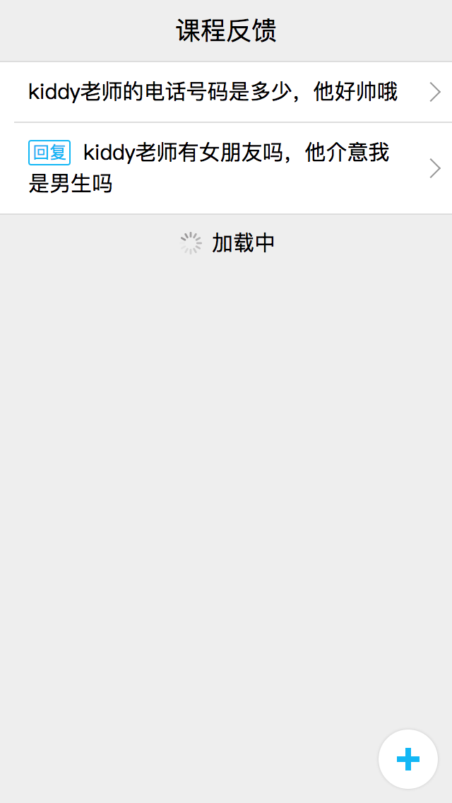
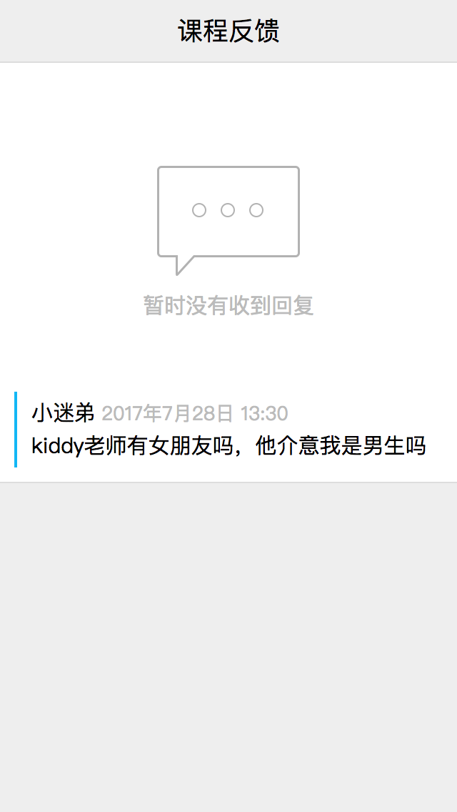
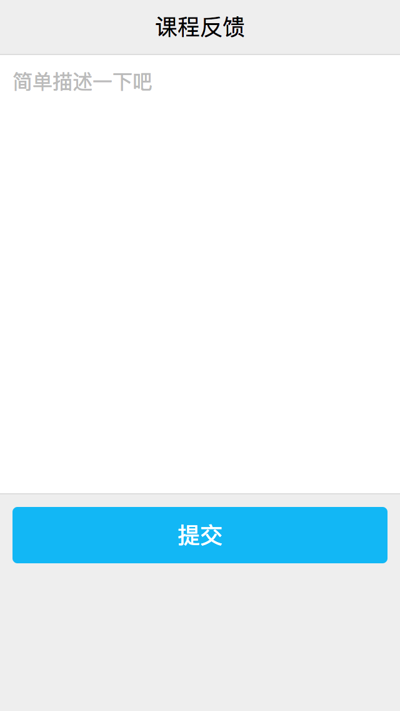

## web应用开发实战
现在我们已经具备开发基本的web应用的能力了。接下来我们会以一个实际的例子作为课程最后的部分。该实例是要完成一个课程反馈的web应用。学生可以登录自己的qq，然后对本课程进行反馈或者提问，老师可以在上面对学生的提问进行回复。

### 需求分析
在开发一个新需求前，作为开发，我们首先需要对需求进行分析，拆解。最终得到一个具体的开发方案，然后才是真正的去开发。
作为前端的部分，一般我们会先重设计稿入手，结合需求文档，看看具体需要实现哪些功能：

#### 设计稿

#### 需求拆分

从设计稿我们可以看出来，这个web应用主要有四个不同的页面，每个页面包括了若干功能

* 反馈列表页
  * 包含所有反馈的列表，需要完成滚动加载
  * 列表中每条反馈信息，需要显示标题，还有是否回复的状态
  * 点击列表中的每一条反馈信息，需要跳转到对于的反馈详情
  * 点击右下角的按钮，需要进入到提交反馈页
* 反馈详情页
  * 详情页面需要显示学生的名字（如果已经认证的，显示真实姓名，如果没有认证，显示昵称）、反馈的内容，反馈的时间
  * 如果当前反馈老师还没有回复，需要显示暂无回复
  * 如果当前反馈老师已经回复，需要显示老师的真实姓名，回复的内容，回复的时间
* 学生提交反馈页
  * 需要填写反馈的内容，并且对字数有限制（50字）
  * 提交前需要校验提交的内容是否合乎规定
  * 提交之后，需要反馈是否提交成功，如果成功，页面进入到反馈详情页，如果不成功，需要提示不成功的原因
* 老师提交回复页
  * 需要显示学生的名字（如果已经认证的，显示真实姓名，如果没有认证，显示昵称）、反馈的内容，反馈的时间
  * 需要填写回复内容，并且对字数有限制（50字）
  * 提交前需要校验提交的内容是否合乎规定
  * 提交之后，需要反馈是否提交成功，如果成功，页面进入到反馈详情页，如果不成功，需要提示不成功的原因

这些基本就是我们这个需求所需要完成的功能点了。

### 接口定义
有了需要，接下来首先要定义接口，这样前后台才能独立开发，而不需要前后等待。有了之前的需求分析，接口的定义就变得十分简单了。

#### 获取反馈列表
|类型|名称|说明|
|-|-|-|
|接口名称|get_feedback_list||
|参数|page:int|当前页码|
|参数|size:int|每页显示条数|
|返回结果|list:array|反馈列表|
||id:string|反馈id|
||content:string|反馈内容|
||is_reply:boolean|是否有回复|
|返回结果|total:int|数据总项数|

#### 获取反馈详情
|类型|名称|说明|
|-|-|-|
|接口名称|get_feedback||
|参数|id:string|反馈id|
|返回结果|id:string|反馈id|
|返回结果|content:string|反馈内容|
|返回结果|author:string|学生姓名|
|返回结果|author_id:long|学生id|
|返回结果|is_reply:boolean|是否有回复|
|返回结果|reply_content:string|回复内容|
|返回结果|reply_author:string|老师姓名|
|返回结果|reply_author_id:long|老师id|

#### 提交反馈
|类型|名称|说明|
|-|-|-|
|接口名称|send_feedback||
|参数|content:string|反馈内容|
|返回结果|msg:string|提交结果|

#### 提交回复
|类型|名称|说明|
|-|-|-|
|接口名称|send_reply||
|参数|id:string|反馈id|
|参数|content:string|回复内容|
|返回结果|msg:string|提交结果|

### 安装服务器

### 编写html，css

### 获取用户授权

### 获取用户数据

### 提交用户数据
