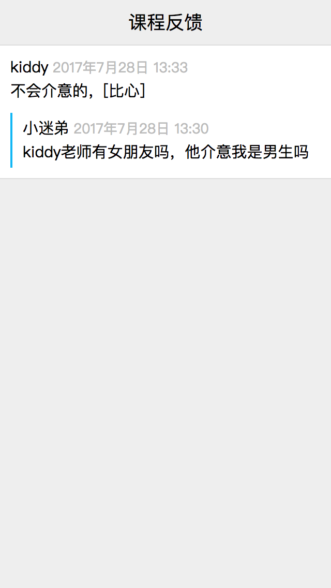
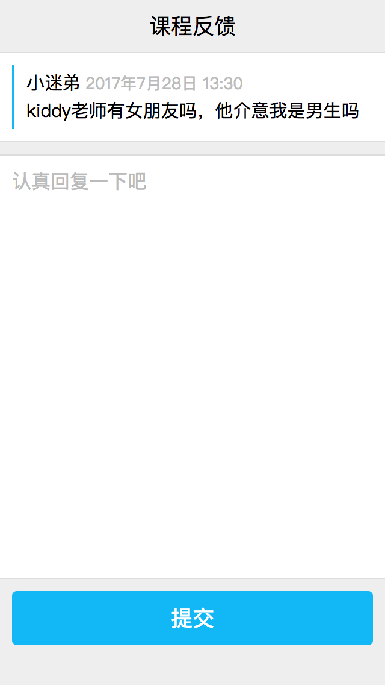

## web应用开发实战
现在我们已经具备开发基本的web应用的能力了。接下来我们会以一个实际的例子作为课程最后的部分。该实例是要完成一个课程反馈的web应用。学生可以登录自己的qq，然后对本课程进行反馈或者提问，老师可以在上面对学生的提问进行回复。

### 需求分析
在开发一个新需求前，作为开发，我们首先需要对需求进行分析，拆解。最终得到一个具体的开发方案，然后才是真正的去开发。
作为前端的部分，一般我们会先重设计稿入手，结合需求文档，看看具体需要实现哪些功能：

#### 设计稿







#### 需求拆分

从设计稿我们可以看出来，这个web应用主要有四个不同的页面，每个页面包括了若干功能

* 反馈列表页
  * 包含所有反馈的列表，需要完成滚动加载
  * 列表中每条反馈信息，需要显示标题，还有是否回复的状态
  * 点击列表中的每一条反馈信息，需要跳转到对于的反馈详情
  * 点击右下角的按钮，需要进入到提交反馈页
* 反馈详情页
  * 详情页面需要显示学生的名字（如果已经认证的，显示真实姓名，如果没有认证，显示昵称）、反馈的内容，反馈的时间
  * 如果当前反馈老师还没有回复，需要显示暂无回复
  * 如果当前反馈老师已经回复，需要显示老师的真实姓名，回复的内容，回复的时间
* 学生提交反馈页
  * 需要填写反馈的内容，并且对字数有限制（50字）
  * 提交前需要校验提交的内容是否合乎规定
  * 提交之后，需要反馈是否提交成功，如果成功，页面进入到反馈详情页，如果不成功，需要提示不成功的原因
* 老师提交回复页
  * 需要显示学生的名字（如果已经认证的，显示真实姓名，如果没有认证，显示昵称）、反馈的内容，反馈的时间
  * 需要填写回复内容，并且对字数有限制（50字）
  * 提交前需要校验提交的内容是否合乎规定
  * 提交之后，需要反馈是否提交成功，如果成功，页面进入到反馈详情页，如果不成功，需要提示不成功的原因

这些基本就是我们这个需求所需要完成的功能点了。

### 接口定义
有了需求，还不能急着开发。接下来首先要定义接口，这样前后台才能独立开发，而不需要前后等待。有了之前的需求分析，接口的定义就变得十分简单了。

#### 获取反馈列表
|类型|名称|说明|
|-|-|-|
|接口名称|get_feedback_list||
|参数|page:int|当前页码|
|参数|size:int|每页显示条数|
|返回结果|list:array|反馈列表|
||id:string|反馈id|
||content:string|反馈内容|
||is_reply:boolean|是否有回复|
|返回结果|total:int|数据总项数|

#### 获取反馈详情
|类型|名称|说明|
|-|-|-|
|接口名称|get_feedback||
|参数|id:string|反馈id|
|返回结果|id:string|反馈id|
|返回结果|content:string|反馈内容|
|返回结果|author:string|学生姓名|
|返回结果|author_id:long|学生id|
|返回结果|is_reply:boolean|是否有回复|
|返回结果|reply_content:string|回复内容|
|返回结果|reply_author:string|老师姓名|
|返回结果|reply_author_id:long|老师id|

#### 提交反馈
|类型|名称|说明|
|-|-|-|
|接口名称|send_feedback||
|参数|content:string|反馈内容|
|返回结果|msg:string|提交结果|

#### 提交回复
|类型|名称|说明|
|-|-|-|
|接口名称|send_reply||
|参数|id:string|反馈id|
|参数|content:string|回复内容|
|返回结果|msg:string|提交结果|

### 安装服务器
这里安装的服务器并非指真正生产环境的服务器，而是为了开发需要安装的本地服务器。通过本地服务器，我们可以把静态文件（html，css，js）转发到本地文件夹中。而对后台接口，我们可以直接反向代理到真实服务器上，这样就方便我们直接在本地调试，但不需要花费额外的精力来切换环境。

这里我安装的nginx，在window下，可以直接下载[安装包](http://nginx.org/download/nginx-1.12.1.zip)来安装。

在mac下，可以直接通过brew来安装:

```bash
brew install nginx
```

安装好以后，在nginx的配置文件中，增加如下配置：

```bash
# 静态文件转发至本地目录
server {
    listen       80;
    server_name  www.whxytest.com;

    location / {
        root   /path/to/local/folder;
        index  index.html index.htm;
    }
}

# 真实服务器
upstream whxytest_cgi {
    server xxx.xxx.xxx.xxx:80;
}

# 后台接口做反向代理
server {
    listen       80;
    server_name  cgi.whxytest.com;

    location / {
        proxy_set_header X-Real-IP $remote_addr;
        proxy_set_header X-Forwarded-For $proxy_add_x_forwarded_for;
        proxy_set_header Host $http_host;
        proxy_set_header X-Nginx-Proxy true;
        proxy_pass http://whxytest_cgi;
    }
}
```

然后启动ngnix，这时我们就可以在浏览器中打开`http://www.whxytest.com`来访问我们的本地文件了，同时后台接口也被正确转发到真实服务器上。

### 编写html
虽然html并不像一般编程语言那么复杂，但也不代表可以随便写。一些良好的html编写习惯可以很好的提高html代码的质量。其中语义化就是一个很好的方法。使用合乎语义的html标签来表达所编写的内容，能使阅读代码的人更快的了解你的意图，也能帮助搜索引擎更好的索引你的web页面，一下同样是一段表示列表的html代码：

#### 非语义化

```html
<div class="list">
  <div class="item">
    <div class="cover">
      <span style="background-image:url(xxx.jpg)"></span>
    </div>
    <div class="content">
      <div class="title">xxxxxx</div>
      <p>xxxxxxxxx</p>
    </div>
  </div>
  <div class="item">
    <div class="cover">
      <span style="background-image:url(xxx.jpg)"></span>
    </div>
    <div class="content">
      <div class="title">xxxxxx</div>
      <p>xxxxxxxxx</p>
    </div>
  </div>
  ...
</div>
```

#### 语义化

```html
<ul class="list">
  <li class="list_item">
    <div class="item">
      <div class="item_cover">
        
      </div>
      <div class="item_content">
        <h4>xxxxxxx</h4>
        <p>xxxxxxx</p>
      </div>
    </div>
  </li>
  <li class="list_item">
    <div class="item">
      <div class="item_cover">
        
      </div>
      <div class="item_content">
        <h4>xxxxxxx</h4>
        <p>xxxxxxx</p>
      </div>
    </div>
  </li>
  ...
</ul>
```

通过合适的标签，能更清晰的表达你的意图，也更方便以后代码的维护和变更。除了语义化以外，模块化也是非常重要的一部份，我将会结合下面的css部分来说明，如何写出更加模块化的html代码。

### 编写css
要编写出好的css也并非易事，这里所指的困难主要来自两个方面。

* 样式的兼容性问题
* 样式的复用度问题

#### 样式的兼容性问题
由于长久以来的浏览器大战，各浏览器厂商为了彰显自己的能力，都纷纷在自家的浏览器上更加很多“厉害”的新特性以图吸引开发人员使用，而且它们各自的新的特性还互不兼容。最终造成的结果，就是开发人员为了使web页面在各个浏览器之间有一致的体验，而不得不使用各种hack技术来兼容各个浏览器。其中css就是hack横飞的重灾区。举个例子，早起的ie6浏览器不支持`position:fixed`属性，因此开发人员需要通过结合`position:absolute`和复杂的css表达式(只有ie支持)来实现相同的效果：

```css
.bottom {
  bottom: 0;
  position: fixed;
  /* 以下代码只有 IE6 能解析 */
  _bottom: auto;
  _position: absolute;
  /* for IE6 ，执行JS语句，documentElement即html对象，clientHeight即可视窗口高度 */
  _top: expression(documentElement.scrollTop + documentElement.clientHeight-this.offsetHeight);
}
```

当然，随着现在w3c标准的进一步推进，这样的css-hack出现得越来越少。

#### 样式的复用度问题
如果我们只是编写一个web页面，十来行css，当然不会考虑所谓的css复用问题，然而一个大型的web应用，一般会涉及到几十个页面，几千甚至上万行css，这时候如何提高css的复用度就变得十分重要了。其中之一的方式是通过css预处理器，使css变得可编程，而常见的css预处理器有：

* LESS
* SASS
* Stylus

但这些方法，对于初次接触css的同学来说，有点太复杂了。而在这里我给大家推荐另一种提高css复用度的方法——[BEM](http://getbem.com/)。BEM是Block-Element-Modifier的首字母缩写，它并不是什么编程语言或者工具，而是一种书写html-css的建议。该建议主要有以下三点：

* 所有能单独存在的个体，均为一个模块
* 所有不能单独存在，而必须依附于其他模块的个体，称为一个元素
* 一个模块或者一个元素的某个状态，称为该模块或元素的修饰

什么意思呢，这里举个例子，我们需要编写一个页面的，该页面为一个搜索学校老师的页面。我们很容易就想到，这个页面至少会包含两个部分，一个是搜索框，一个是搜索结果列表，而且这两个部分，应该是独立存在的（例如google就把它的搜索框和搜索结果放到不同的页面）。因此我们就可以称搜索框和搜索列表是两个独立的**模块**。

而搜索框中，会有两个不同的部分，一个是输入框，一个是提交按钮。虽然两者在某些情况下是可以独立存在的，然而在我们当前的场景下，它们都是搜索框的一部分，少了谁都不是搜索框。因此我们就可以称输入框和提交按钮，是搜索框模块中的两个**元素**。

最后，按照我们的日常习惯，输入框在获得焦点前后，应该会出现边框颜色的不同，也就是输入框在获得焦点后会从正常状态，进入到高亮状态。因此这个高亮状态，我们可以称之为输入框元素的一个**修饰**。

现在我们可以理解BEM的意思了，但还是不知道应该怎么编写可复用的css？其实我们只要把上面BEM的关系，映射到html的class命名上即可，BEM的建议如下：

```css
.block--modifier {
  
}
.block__element--modifier {
  
}
```

也就是模块和元素之间用`__`划分，模块或元素和修饰之间用`--`划分。下面结合上面的输入框例子：

```html
<div class="searchbar">
  <input class="searchbar__input" type="text">
  <button class="searchbar__button">搜索</button>
</div>
```

```css
.searchbar {
  display: flex;
}
.searchbar__input {
  display: block;
  margin: 0;
  padding: 10px;
  border: 1px solid #b8b8b8;
  border-right-color: transparent;
  outline: none;
  height: 20px;
  flex: 1;
}
.searchbar__input--focus {
  border-color: #4791ff;
}
.searchbar__button {
  display: block;
  margin: 0;
  padding: 0;
  border: 1px solid #2d78f4;
  outline: none;
  width: 100px;
  height: 42px;
  background: #3385ff;
  color: white;
}
```

一旦我们按照BEM的建议书写html-css时，我们就会发现由于模块是独立存在的，因此在不同页面或者页面中的不同地方都可以重复使用。这样我们就能对html和css进行模块化，提高代码的复用度，最终有效的提高我们页面的质量。

### 组件化和MV*
有了html和css，我们就可以开始编写我们的js代码了。js是一门脚本语言，相对于c语言来说比较简单，也没有c语言那么严格。基本上练习一两周，就可以写出比较“复杂”的js代码了。然而js也并没有想象中那么简单，由于web页面编程属于gui编程的一种，因此所有传统gui编程会遇到的问题，在web页面中都有机会遇到。而js作为web页面的编程语言，在编写的过程，也必然会遇到gui编程中的各种常见的坑。而其中之一的大坑就是代码强耦合问题。在我们之前编写的新闻应用例子中，我们就曾写出这样的代码：

```javascript
getData().done(function (data) {
  // 渲染列表
  $("#list").html(renderList(data.list));

  // 监听列表的点击事件，这里采用了事件代理的方式，减少内存占用
  $("#list").on("click", "li", function () {
    var idx = $(this).data("idx");
    var item = data.list[idx];

    location.href = item.detail_url;
  });
});
```

这段代码咋看之下没有什么问题。然而如果我们需求变更了，需要在页面的左上角增加一个显示新闻总数的计数器，那我们就需要在`done`方法的回调函数中，写入：

```javascript
getData().done(function (data) {
  $("#total").html(data.total);
  ...
});
```

每次这样的需求变更，我们都需要破坏原来的代码，写入新的内容。久而久之，代码就会变得不可维护。产生这样结果的原因，是我们在编写代码时，把数据的获取和DOM更新强耦合在一起。而实际上，更好的做法，是把DOM的更新封装在各自的组件中，数据通过“注入”的方式和组件之间产生联系，这个封装的过程我们称之为组件化：

```javascript
var model = {
  $data: getData(),

  get: function (idx) {
    var list = model.list;

    if (!list) {
      return null;
    }

    return list[idx];
  }, 

  done: function (fn) {
    this.$data.then(function (data) {
      model.list = data.list;
      model.total = data.total;

      fn && fn(data);
    });
  }
};

// 定义list组件
var list = {
  // dom元素
  $list: $("#list"),
  
  // 数据注入
  bind: function (model) {
    list.model = model;

    list.event();
    list.watch();
  },

  event: function () {
    var model = this.model;

    this.$list.on("click", "li", function () {
      var idx = $(this).data("idx");
      var item = model.get(idx);

      location.href = item.datail_url;
    });
  },

  watch: function () {
    var model = this.model;

    model.done(function (data) {
      list.render(data);
    });
  },

  render: function (data) {
    function renderList(list) {
      return list.map(renderItem).join("");
    }

    function renderItem(item, idx) {
      return `
        <li data-idx="${ idx }">
          <div class="news">
            <span class="news_cover" style="background-image:url(${ item.cover_url })"></span>
            <div>
              <h2>${ item.title }</h2>
              <p>${ item.description }</p>
            </div>
          </div>
        </li>
      `;
    }

    this.$list.html(renderList(data.list));
  }
};

list.bind(model);
```

虽然代码量是多了。然而当需求发生变更时，我们就可以再编写另外的组件，然后把数据“注入”到新组件中，而原来的`list`组件不需要做任何修改。

上面说的这种开发的模式，有一个更专业的名字，叫MVC，亦即Model-View-Controller，是Xerox PARC在二十世纪八十年代为编程语言Smalltalk－80发明的一种软件设计模式，已被广泛使用在gui编程领域。其中Model即为数据的部分，负责数据的获取和处理。而View是视图的意思，具体到web开发上就是指的DOM。而我们的组件，则扮演着MVC中Controller的角色。通过监听Model的变化来操作DOM更新，当用户触发DOM事件时，组件也会因应不同的情况来操作Model。

当然，随着web的发展，前端工程师们在MVC的基础上又发展出MVP、MVVM等不同的开发模式，但究其本质就是MVC，只是在MVC的基础上，更加明确各部分的功能和限制，使得开发者在使用上更加便利，而这一类MVC的变体，我们都统称为MV*。